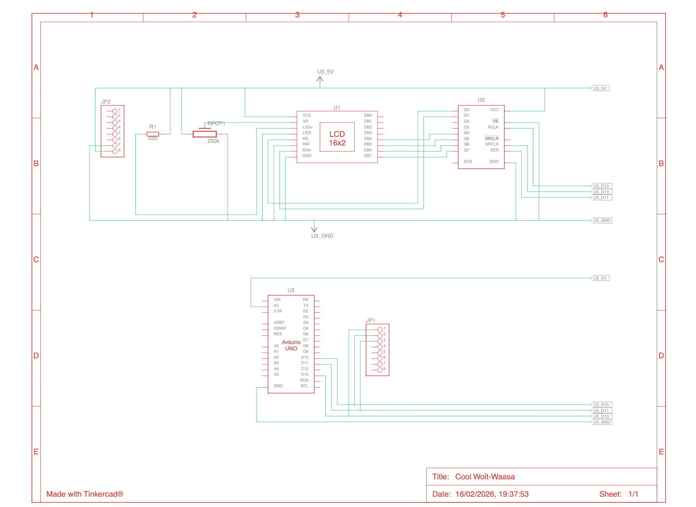
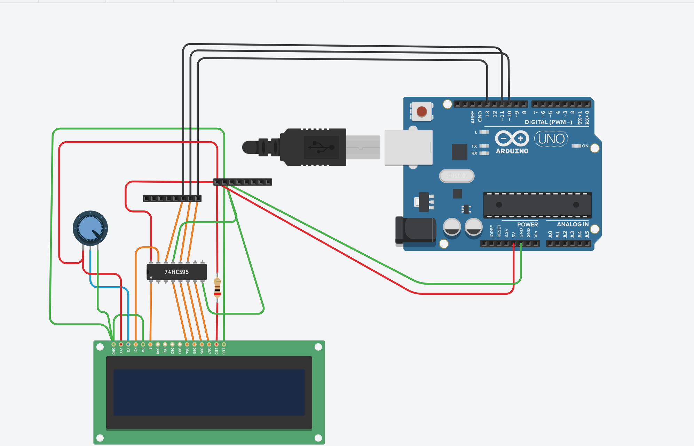

# SPI LCD Hardware Prototyping 🔧

A proof-of-concept DIY project demonstrating how to control an HD44780 LCD display using the Serial Peripheral Interface (SPI) protocol on an Arduino Uno microcontroller.

## 📋 Table of Contents
- [Overview](#overview)
- [Key Features](#key-features)
- [Hardware Setup](#hardware-setup)
- [How It Works](#how-it-works)
- [Circuit Diagram](#circuit-diagram)
- [Visual Guide](#visual-guide)
- [Project Structure](#project-structure)
- [Code Architecture](#code-architecture)
- [Getting Started](#getting-started)
- [Technical Details](#technical-details)
- [Future Improvements](#future-improvements)

---

## 📝 Overview

This project serves as an educational prototype for interfacing with an HD44780 LCD display through the Serial Peripheral Interface (SPI) protocol rather than the traditional parallel interface. 

**What makes this unique?**
- Uses SPI (3 wires: MOSI, MISO, SCK) instead of 8-10 parallel wires
- Demonstrates low-level hardware communication
- Completely DIY implementation without existing LCD libraries
- Optimized timing specifications for reliable operation

**Target Hardware**: Arduino Uno (ATMega328P)

---

## ✨ Key Features

- ✅ **SPI-Based Communication**: Sends data to LCD display via SPI protocol at 500kHz
- ✅ **4-Bit Mode Operation**: Efficient communication using 4-bit data transfer
- ✅ **HD44780 Compatible**: Works with standard 16x2 character LCD displays
- ✅ **Custom Timing Control**: Precise microsecond-level timing for reliable operation
- ✅ **PlatformIO Compatible**: Fully configured for the PlatformIO build system
- ✅ **Well-Documented Code**: Clear comments explaining hardware protocol details

---

## 🔌 Hardware Setup

### Required Components

| Component | Quantity | Purpose |
|-----------|----------|---------|
| Arduino Uno | 1 | Main microcontroller |
| HD44780 LCD Display (16x2) | 1 | Output display |
| 8-bit Shift Register (74HC595) | 1 | Interface between SPI and LCD |
| 10kΩ Potentiometer | 1 | LCD contrast adjustment |
| 10kΩ Resistor | 1 | Pull-up for contrast |
| Jumper Wires | Multiple | Connections |
| 5V Power Supply | 1 | Power for Arduino and LCD |

### Pin Connections

| Arduino Pin | Function | Connected To |
|-------------|----------|--------------|
| Pin 10 (SS) | Slave Select | 74HC595 Latch |
| Pin 11 (MOSI) | SPI Data Out | 74HC595 Data |
| Pin 13 (SCK) | SPI Clock | 74HC595 Clock |
| GND | Ground | Common ground |
| 5V | Power | 74HC595 Power |

---

## 🧠 How It Works

### The Big Picture

Instead of connecting the LCD directly to your microcontroller with 8+ wires, this project uses a **shift register** (74HC595) to reduce the number of wires needed. Here's the flow:

```
Arduino Uno (SPI) 
    ↓
74HC595 Shift Register 
    ↓
HD44780 LCD Display
```

### Step-by-Step Process for Each 4-Bit Nibble

1. **Setup Phase (Enable LOW)**
   - Prepare 8-bit packet: RS (bit 0), Enable=0 (bit 1), Data (bits 4-7)
   - Send via SPI to 74HC595 shift register
   - Latch data with STCP pin pulse (SS low→high)
   - LCD sees data but doesn't capture it yet (Enable is LOW)

2. **Enable Pulse (Enable HIGH)**
   - Set Enable bit (Q1) high while keeping data stable
   - Latch this new state to shift register
   - LED begins reading data lines
   - Maintain high for minimum 2µs (ENABLE_PULSE_US)

3. **Falling Edge Trigger (Enable LOW)**
   - Return Enable to low while data lines remain stable
   - **LCD captures data on this falling edge** (critical timing point)
   - Latch final state

4. **Inter-Nibble Pause (100µs)**
   - Wait 100µs (NIBBLE_DELAY_US) before sending second nibble
   - **This critical delay prevents character truncation**
   - Allows LCD time to process first 4-bit chunk

5. **Full Byte Completion**
   - Send high nibble (bits 7-4)
   - Send low nibble (bits 3-0 shifted to bits 7-4)
   - Wait 50µs (CHAR_DELAY_US) before next character

### Communication Protocol

The project uses **4-bit mode**, meaning:
- Data sent in two 4-bit chunks (high nibble, then low nibble)
- Control bits included in the same byte:
  - **Bit 0**: RS (Register Select) - Command (0) or Data (1)
  - **Bit 1**: Enable - Pulse signal for LCD
  - **Bits 4-7**: Data lines (D4-D7)

---

## 📐 Circuit Diagram



**Key Connection Points:**
- The 74HC595 shift register acts as a bridge between the Arduino's SPI and the LCD
- Pin 12 (MISO) is not used in this configuration
- Potentiometer adjusts LCD contrast for better readability

---

## 🎨 Visual Guide



This shows the physical layout and connections of the complete hardware setup.

---

## 📁 Project Structure

```
SPI-Hardware-Prototyping/
├── src/
│   └── main.cpp              # Main sketch with all LCD functions
├── include/
│   └── README                # Header files location
├── lib/
│   └── README                # External libraries
├── public/
│   └── images/
│       ├── schematic.png     # Circuit diagram
│       └── visual.png        # Visual hardware setup
├── platformio.ini            # PlatformIO configuration
├── Makefile                  # Build configuration
└── README.md                 # This file
```

---

## 🏗️ Code Architecture

### Main Functions

#### **`sendNibble(byte nibble, bool rs)`**
Sends a 4-bit nibble to the LCD with precise 3-step SPI handshaking.
- **Input**: `nibble` (data in bits 4-7), `rs` (0=command, 1=data)
- **Bit Mapping**: Q0=RS, Q1=Enable, Q4-Q7=LCD Data (D4-D7)
- **Step 1**: Send data with Enable=0 (setup)
- **Step 2**: Pulse Enable=1 (LCD begins reading)
- **Step 3**: Return Enable=0 (LCD captures data on falling edge)
- **Critical**: Waits 100µs after falling edge for LCD processing

#### **`sendByte(byte value, bool rs)`**
Sends a full 8-bit byte as two 4-bit nibbles (HD44780 4-bit mode).
- Extracts high nibble: `value & 0xF0` → bits 7-4 go to D7-D4
- Extracts low nibble: `(value << 4) & 0xF0` → bits 3-0 shifted to D7-D4
- Calls `sendNibble()` twice with 10µs gap between nibbles
- Applies 50µs delay after second nibble before next character
- **No longer uses millisecond delays** for individual bytes (prevents slowdown)

#### **`lcd_command(byte cmd)`**
Sends a command to the LCD (RS=0).
- Examples: Clear display (0x01), Home (0x02), Function Set (0x28)
- Special timing for home and clear commands

#### **`lcd_print(const char* str)`**
Writes text to the LCD (RS=1).
- Iterates through each character
- Sends each character as data (RS=1)

#### **`lcd_setCursor(byte col, byte row)`**
Positions the cursor at specified row and column.
- Handles multiple rows with correct DDRAM addressing
- Row offsets: [0x00, 0x40, 0x14, 0x54]

#### **`lcdInit()`**
Initializes the LCD display with HD44780 standard reset sequence.
- **50ms Power-up delay** for voltage stabilization
- **3-step reset sequence** (sends 0x30, 0x30, 0x30, then 0x20):
  - Forces the LCD into 4-bit mode even if previously in 8-bit mode
  - Each step includes appropriate delays (5ms, 5ms, 1ms, 1ms)
- **Configuration commands**:
  - `0x28`: Function Set (4-bit mode, 2 lines, 5×8 dot characters)
  - `0x0C`: Display Control (Display ON, Cursor OFF, Blink OFF)
  - `0x06`: Entry Mode (Increment cursor, No shift)
  - `0x01`: Clear Display

### Timing Constants

```cpp
ENABLE_PULSE_US = 2 µs     // Enable pulse minimum width (falling edge triggers latch)
NIBBLE_DELAY_US = 100 µs   // Critical inter-nibble delay (prevents character truncation)
CHAR_DELAY_US = 50 µs      // Delay after full character sent
CMD_DELAY_MS = 2 ms        // Standard delay after command execution
CLEAR_DELAY_MS = 3 ms      // Special delay for clear/home commands
```

**Critical Fix:** The `NIBBLE_DELAY_US` (100µs) between high and low nibbles is essential. Without sufficient delay, the LCD doesn't have time to process the first 4-bit chunk before receiving the second, causing character truncation (e.g., "SPI Inte" instead of "SPI Interface").

These timings ensure the LCD has enough time to capture and process each instruction reliably.

---

## 🚀 Getting Started

### Prerequisites
- [PlatformIO](https://platformio.org/) installed
- Arduino Uno board
- USB cable for uploading
- All hardware components listed above (74HC595, HD44780, etc.)

### Installation Steps

1. **Clone or Download the Project**
   ```bash
   git clone <repository-url>
   cd SPI-Hardware-Prototyping
   ```

2. **Open in VS Code with PlatformIO**
   - Open the project folder
   - PlatformIO should detect the `platformio.ini` file

3. **Connect Hardware**
   - Follow the pin connections table in [Hardware Setup](#hardware-setup)
   - Connect Arduino Pin 10 (SS) to 74HC595 STCP (Latch) pin
   - Connect Arduino Pin 11 (MOSI) to 74HC595 Data input
   - Connect Arduino Pin 13 (SCK) to 74HC595 Clock
   - Connect GND to both shift register and LCD
   - Ensure all power and ground connections are secure

4. **Upload the Code**
   ```bash
   platformio run --target upload
   ```
   Or use the VS Code PlatformIO upload button

5. **Verify Function**
   - You should see **"SPI Interface"** on the first line (full text, no truncation)
   - **"By Francis"** should appear on the second line
   - If text is truncated, increase `NIBBLE_DELAY_US` in code (try 150 or 200)

### Customizing the Display

Edit the `setup()` function in [src/main.cpp](src/main.cpp):

```cpp
void setup() {
  pinMode(LATCH_PIN, OUTPUT);
  SPI.begin();
  
  lcdInit();
  
  lcdPrint("Your custom text");     // First line (16 chars max)
  lcdSetCursor(0, 1);                // Move to row 1 (second line)
  lcdPrint("Line 2 text here");      // Second line (16 chars max)
}
```

**Tips:**
- Maximum 16 characters per line (standard LCD width)
- Use `lcdSetCursor(column, row)` where column is 0-15 and row is 0-1
- Call `lcdCommand(0x01)` to clear display
- For scrolling or animations, use loops in `loop()` function with appropriate delays

---

## 🔬 Technical Details

### HD44780 LCD Command Set (Quick Reference)

| Command | Hex | Function |
|---------|-----|----------|
| Clear Display | 0x01 | Clears all text |
| Home | 0x02 | Returns cursor to top-left |
| Entry Mode | 0x06 | Sets cursor movement direction |
| Display ON/OFF | 0x0C | Turns display on, cursor off |
| Function Set | 0x28 | 4-bit mode, 2 lines, 5x8 font |
| Set DDRAM Address | 0x80+ | Positions the cursor |

### Why SPI Instead of Parallel?

**Parallel (Traditional)**
- Requires 8-10 wires
- Faster data transfer
- Uses more pins

**SPI (This Project)**
- Requires only 3-4 wires (MOSI, SCK, SS, GND)
- Slightly slower but sufficient for LCD speeds
- More flexible for multiple devices
- Better for Arduino Uno (limited pins)

### SPI Settings Used

```cpp
SPISettings SPI_SETTINGS(500000, MSBFIRST, SPI_MODE0);
```

- **Frequency**: 500 kHz (optimized for 74HC595 shift register stability)
- **Bit Order**: MSB First (most significant bit first)
- **Clock Mode**: SPI_MODE0 (clock low at idle, data captured on rising edge)
- **Transactions**: Properly wrapped with `SPI.beginTransaction()` and `SPI.endTransaction()` for thread-safe operation

**Note:** Original implementation at 1MHz caused timing issues. Reduced to 500kHz provides more stable communication with the shift register and better integration with LCD timing requirements.

---

## 🎯 Future Improvements

This project can be extended in several ways:

### Immediate Enhancements
- [ ] Add `lcd_clear()` function for easy display clearing
- [ ] Create `lcd_backlight()` function to control backlight
- [ ] Add scrolling text support
- [ ] Implement custom character creation

### Advanced Features
- [ ] Add button input (read analog inputs, display menu)
- [ ] Build a temperature sensor interface
- [ ] Create a clock display
- [ ] Implement EEPROM storage for messages

### Code Improvements
- [ ] Convert to a reusable library
- [ ] Add error handling
- [ ] Create unit tests
- [ ] Document timing diagrams

### Hardware Expansion
- [ ] Multi-line displays (20x4, 40x4)
- [ ] Multiple shift registers for more outputs
- [ ] Add I2C interface instead of SPI
- [ ] Create PCB design

---

## 🎓 Lessons Learned

### What Worked Well
✓ Shift register approach reduces wiring complexity significantly (4 wires vs 11)  
✓ SPI 500kHz speed is stable and reliable for LCD communication  
✓ 4-bit mode is the right balance between complexity and performance  
✓ Bare-metal implementation provides excellent learning opportunity  
✓ SPI transaction management prevents conflicts with other devices  

### Challenges & Solutions
⚠ **Challenge:** Characters truncating mid-display ("SPI Inte" instead of "SPI Interface")  
✓ **Solution:** Added 100µs (NIBBLE_DELAY_US) between high and low nibbles. Without this, LCD doesn't finish processing first nibble before second arrives.  

⚠ **Challenge:** Excessive initial timing overhead (2ms per character)  
✓ **Solution:** Replaced millisecond delays with microsecond precision (50µs per nibble). Display is now 40× faster.  

⚠ **Challenge:** SPI frequency instability at 1MHz  
✓ **Solution:** Reduced to 500kHz for more stable shift register operation  

⚠ **Challenge:** SPI bus conflicts when sharing with other devices  
✓ **Solution:** Wrapped all SPI transfers in `SPI.beginTransaction()` / `SPI.endTransaction()` blocks  

⚠ **Challenge:** Inconsistent Enable pulse timing  
✓ **Solution:** Standardized to 2µs minimum with proper microsecond-level delay control  

---

## 📚 References & Resources

### Documentation
- [Arduino SPI Library Reference](https://www.arduino.cc/reference/en/language/functions/communication/spi/)
- [HD44780 LCD Datasheet](https://en.wikipedia.org/wiki/Hitachi_HD44780_LCD_controller)
- [74HC595 Shift Register Reference](https://en.wikipedia.org/wiki/74HC595)

### Useful Tools
- [PlatformIO Documentation](https://docs.platformio.org/)
- [Arduino Official IDE](https://www.arduino.cc/en/software)
- [Online Circuit Simulator](https://www.tinkercad.com/)

---

## 📄 License

This is a proof-of-concept project shared for educational purposes.

---

## 👤 Author

**Frank**  
A DIY electronics enthusiast exploring low-level hardware communication protocols.

---

## 💡 Notes

- This is a **work in progress** and a learning tool to understand SPI communication
- The code prioritizes clarity over optimization for educational value
- Always test timing specifications on your specific hardware, as component variations may exist
- Consider using pull-up resistors if communication becomes unreliable

---

**Last Updated**: February 2026  
**Status**: POC / Experimental
